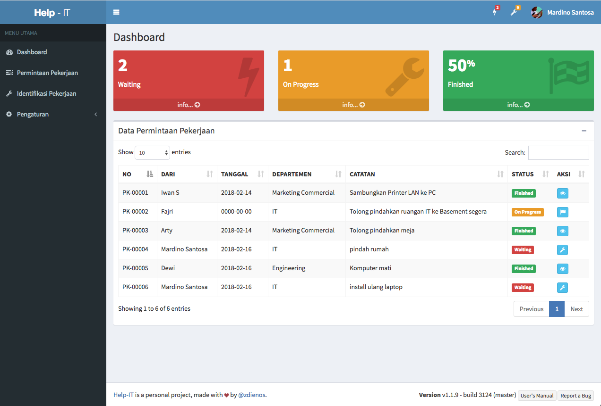

# help-it
Merupakan aplikasi web berbasis codeigniter untuk keperluan manajemen pekerjaan (work order) khususnya bidang IT

## Getting Started

Masih versi awal, digunakan agar antar team/karyawan, bisa saling mengetahui pekerjaan bar apa yang diinginkan oleh departemen lain (atau bisa departemen sendiri). Kemudian melihat juga pekerjaan yang sementara dikerjakan (atau on progress). Cukup membantulah, dibanding harus menulis-nulis di whiteboard. 



### Prerequisites

Cuma butuh komputer :D

```
Apache/Ngix Server
PHP
MySQL
```

### Installing

Edit file database.php, sesuaikan dengan kondisi komputer/server Anda.


```
'hostname' => 'localhost',
'username' => 'root',
'password' => 'root',
'database' => 'help-it',
```

Buat database help-it, kemudian import database 

```
help-it.sql
```

## Fitur

* Menggunakan template AdminLTE
*	Tampilan yang bersih
*	Responsive

  
## Dibuat Menggunakan

* [CodeIgniter](https://codeigniter.com/) - Framework v3.1.7
* [AdminLTE](https://adminlte.io/) - Control Panel Template


## Authors

* **Mardino Santosa** - [zdienos](https://github.com/zdienos)


## License

Tanpa lisensi, bebas gunakan, modifikasi, bahkan versioning di github saya.

## ChangeLog

### v1.1.9 - Feb 19, 2018
* Permintaan Pekerjaan (work order)</li>
* Identifikasi Pekerjaan (dengan persentase progress)</li>
* Menu Departemen</li>
* Menu Profil untuk mengganti foto dan update profil (nama dan password)</li>


